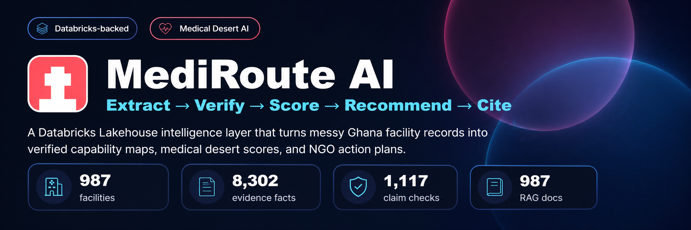
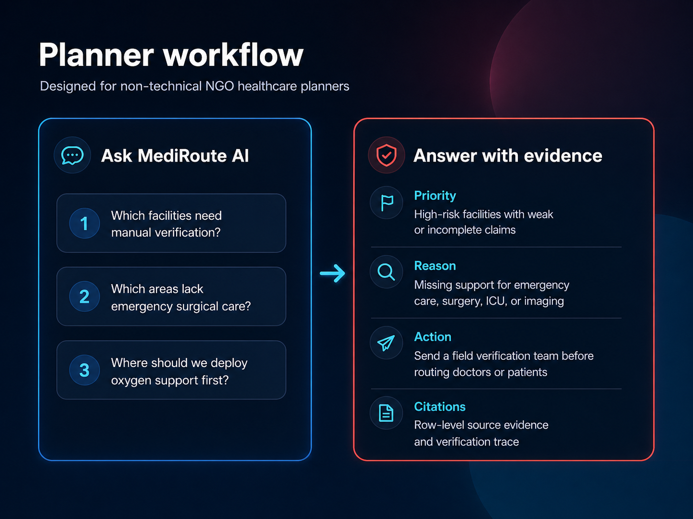
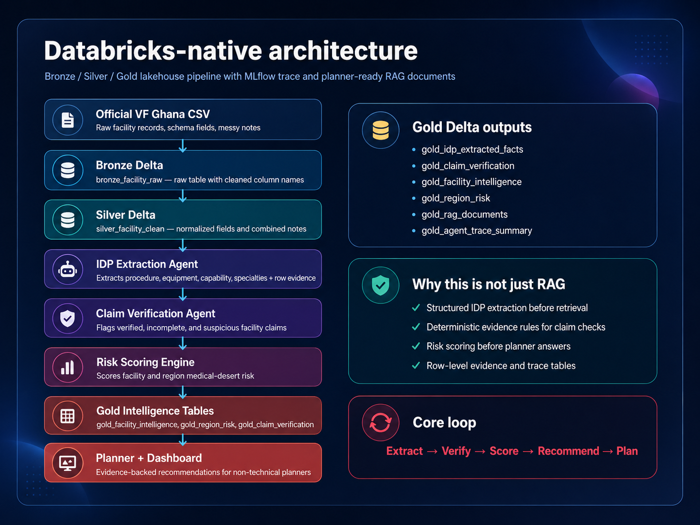
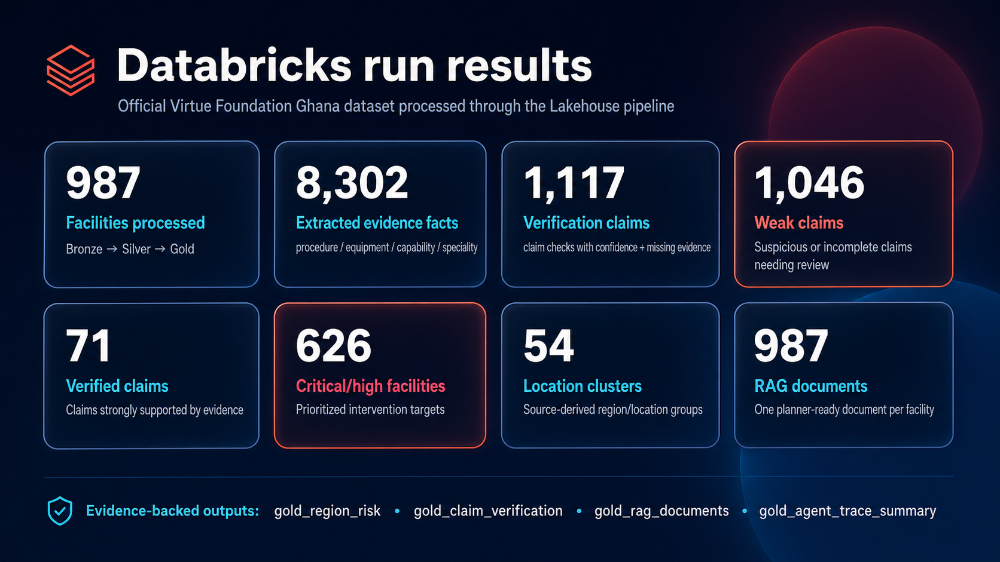

<p align="center">
  
</p>

<p align="center">
  <b>Databricks-backed medical desert intelligence for NGO healthcare planning.</b>
</p>

<p align="center">
  <a href="#why-mediroute-ai">Why</a> •
  <a href="#what-it-does">Features</a> •
  <a href="#databricks-architecture">Architecture</a> •
  <a href="#results-from-the-official-dataset">Results</a> •
  <a href="#run-locally">Run Locally</a> •
  <a href="#run-on-databricks">Run on Databricks</a>
</p>

<p align="center">
  
  
  
  
  
</p>

---

## Why MediRoute AI

Healthcare expertise often exists, but it is not coordinated with the hospitals and communities that need it most. Facility records are messy: one row may mention equipment, another may mention services, and another may contain incomplete or suspicious capability claims.

**MediRoute AI** turns that fragmented data into planner-ready intelligence:

> **Extract → Verify → Score → Recommend → Cite**

It is not a hospital search engine. It is a healthcare coordination layer for NGOs and planners who need to answer:

- Which facilities actually have critical capabilities?
- Which claims need manual verification?
- Which locations are at risk of becoming medical deserts?
- Where should doctors, equipment, or field teams be deployed first?

---

## What it does

### 1. IDP extraction

MediRoute AI parses official facility records and free-form medical text to extract:

| Extracted field | Meaning |
|---|---|
| `procedure` | Clinical services, procedures, diagnostics, operations |
| `equipment` | Devices and infrastructure such as X-ray, oxygen, operating theatre |
| `capability` | Higher-level care capability such as ICU, emergency care, maternity care |
| `specialties` | Medical specialty signals such as surgery, pediatrics, OB/GYN |

Each extracted fact keeps row-level evidence so planner answers can be traced back to the source record.

### 2. Claim verification

The verification engine checks whether a facility claim is supported by the expected evidence.

| Claim checked | Supporting evidence expected |
|---|---|
| Emergency surgical care | operating theatre, anesthesia, blood bank, surgery signal |
| Emergency obstetric care | C-section, blood bank, operating theatre, OB/GYN signal |
| ICU-level care | ICU, oxygen, monitors, ventilator |
| Emergency response | emergency service, ambulance, triage, oxygen |
| Imaging diagnostics | X-ray, ultrasound, CT, MRI |
| Laboratory diagnostics | laboratory, analyzer, diagnostic test |

Every claim is classified as:

```text
Verified / Incomplete / Suspicious / Not claimed
```

### 3. Medical desert scoring

The system calculates facility and location-cluster risk using:

- missing critical capabilities
- weak or suspicious claims
- low doctor count
- low bed capacity
- missing equipment evidence
- lack of verified specialty/capability support

### 4. Planner assistant

The dashboard includes an **Ask Agent** flow for questions like:

```text
Which facilities need manual verification?
Which areas lack emergency surgical care?
Where should we deploy oxygen support first?
Which facilities claim ICU-level care but lack supporting evidence?
```

The response includes the facility, claim status, missing evidence, and source row context.

### 5. Evidence and traceability

The product produces:

- row-level extracted evidence
- claim verification table
- medical desert scoring table
- RAG-ready facility documents
- Databricks MLflow/Delta agent trace

---


---

## Winning upgrades added

MediRoute AI now includes a planner-facing decision layer beyond the base IDP pipeline:

| Upgrade | Why it matters |
|---|---|
| **Intervention Priority Board** | Converts evidence into a ranked action queue for NGO planners. |
| **Intervention Simulator** | Lets planners allocate limited field teams, oxygen kits, surgical teams, imaging units, and lab kits. |
| **Trust & Evaluation tab** | Shows extraction coverage, verification coverage, weak-claim ratio, RAG document coverage, and quality checks. |
| **Evidence-first Ask Agent** | Returns priorities, reasons, recommended actions, and row-level evidence instead of generic summaries. |
| **Databricks SQL Dashboard Pack** | Provides ready-to-use SQL queries for Databricks-native dashboard tiles. |

<p align="center">
  
</p>

## Databricks architecture

<p align="center">
  
</p>

MediRoute AI uses Databricks as the Lakehouse backbone:

```text
Official VF Ghana CSV
        ↓
Bronze Delta: bronze_facility_raw
        ↓
Silver Delta: silver_facility_clean
        ↓
IDP Extraction Agent
        ↓
Gold Delta: gold_idp_extracted_facts
        ↓
Claim Verification Agent
        ↓
Gold Delta: gold_claim_verification
        ↓
Risk Scoring Engine
        ↓
Gold Delta: gold_facility_risk + gold_region_risk
        ↓
RAG Prep: gold_rag_documents
        ↓
MLflow / Delta trace + Streamlit dashboard
```

### Gold tables produced

| Table | Purpose |
|---|---|
| `gold_idp_extracted_facts` | Row-level extracted procedure/equipment/capability/specialty evidence |
| `gold_claim_verification` | Claim status, confidence, supporting evidence, missing evidence |
| `gold_facility_intelligence` | Planner-ready facility-level intelligence |
| `gold_facility_risk` | Facility risk score and recommended action |
| `gold_region_risk` | Location/region-cluster medical desert risk |
| `gold_rag_documents` | One retrievable document per facility for planner/RAG workflows |
| `gold_agent_trace_summary` | Agent-step trace and run metrics |
| `gold_quality_checks` | Data quality and product validation checks |

---

## Results from the official dataset

<p align="center">
  
</p>

Databricks run summary:

| Metric | Value |
|---|---:|
| Facilities processed | **987** |
| Extracted evidence facts | **8,302** |
| Verification claims | **1,117** |
| Weak / suspicious / incomplete claims | **1,046** |
| Verified claims | **71** |
| Critical / high-risk facilities | **626** |
| Source-derived location clusters | **54** |
| RAG-ready facility documents | **987** |

> Note: the 54 location clusters come from the source location/region fields. They are used for planning and risk grouping; they are not claimed to be official administrative regions.

---

## Planner workflow

<p align="center">
  
</p>

Example output style:

```text
Facility: Example District Hospital
Claim: Emergency surgical care
Status: Incomplete
Missing evidence: anesthesia, blood bank
Recommended action: send field verification team before routing patients or doctors.
Evidence: source row + extracted facility note
```

---

## Dashboard

The Streamlit dashboard includes:

| Page | Purpose |
|---|---|
| Overview | Key metrics, highest-risk facilities, claim status distribution |
| Medical Desert Map | Visual map of facility risk and coverage gaps |
| Facility Intelligence | Facility-level extracted facts, risks, and verification results |
| Ask Agent | Planner-style natural language questions |
| Evidence Trace | Row-level evidence and claim verification trail |
| Databricks Trace | Databricks pipeline/agent-step trace summary |

---

## Tech stack

| Layer | Technology |
|---|---|
| Data platform | Databricks Free Edition |
| Storage | Delta Lake tables |
| Processing | PySpark, Pandas |
| Traceability | MLflow + Delta trace table |
| App | Streamlit |
| Mapping | PyDeck / offline Ghana geocoding fallback |
| RAG prep | `gold_rag_documents` table |
| Validation | Pydantic-style schema references + quality checks |

---

## Run locally

```bash
cd mediroute-ai

python -m venv .venv
source .venv/bin/activate

python -m pip install --upgrade pip setuptools wheel
python -m pip install -r requirements-local.txt

python run_pipeline.py
python -m streamlit run app/streamlit_app.py
```

Open:

```text
http://localhost:8501
```

### Windows PowerShell

```powershell
cd mediroute-ai

python -m venv .venv
.venv\Scripts\Activate.ps1

python -m pip install --upgrade pip setuptools wheel
python -m pip install -r requirements-local.txt

python run_pipeline.py
python -m streamlit run app/streamlit_app.py
```

---

## Run on Databricks

### 1. Create schema and upload dataset

Recommended Free Edition setup:

```text
catalog = workspace
schema = mediroute_ai
source_path = /Volumes/workspace/mediroute_ai/raw/Virtue Foundation Ghana v0.3 - Sheet1.csv
```

Create a volume and upload the official CSV:

```sql
CREATE SCHEMA IF NOT EXISTS workspace.mediroute_ai;
CREATE VOLUME IF NOT EXISTS workspace.mediroute_ai.raw;
```

Upload the CSV to:

```text
/Volumes/workspace/mediroute_ai/raw/Virtue Foundation Ghana v0.3 - Sheet1.csv
```

### 2. Run notebooks in order

Import notebooks from:

```text
databricks/notebooks/
```

Run:

```text
00_setup_config
01_bronze_ingest_delta
02_silver_normalize
03_gold_agent_pipeline
04_mlflow_agent_trace
05_vector_search_prep
06_quality_checks
07_export_for_app
```

### 3. Expected Databricks proof tables

After the notebooks run, the schema should contain:

```text
bronze_facility_raw
silver_facility_clean
gold_idp_extracted_facts
gold_claim_verification
gold_facility_intelligence
gold_facility_risk
gold_region_risk
gold_agent_trace_summary
gold_rag_documents
gold_quality_checks
gold_quality_summary
```

---

## Databricks Asset Bundle

A Databricks Asset Bundle config is included for future deployment:

```bash
databricks bundle validate -t dev
databricks bundle deploy -t dev
databricks bundle run mediroute_ai_pipeline -t dev
```

For the hackathon demo, manual notebook execution in Databricks Free Edition is recommended because it is simpler and easier to verify live.

---

## Repository structure

```text
mediroute-ai/
├── app/
│   └── streamlit_app.py
├── assets/
│   └── github/
│       ├── hero.svg
│       ├── architecture.svg
│       ├── metrics.svg
│       └── planner_workflow.svg
├── databricks/
│   └── notebooks/
├── resources/
│   └── mediroute_job.yml
├── src/mediroute/
│   ├── extractor.py
│   ├── verifier.py
│   ├── scoring.py
│   ├── planner.py
│   ├── geo.py
│   └── pipeline.py
├── data/
│   ├── official/
│   ├── sample/
│   ├── processed/
│   └── contracts/
├── docs/
├── prompts_reference/
├── sql/
├── scripts/
├── databricks.yml
├── app.yaml
├── requirements-local.txt
├── requirements-databricks.txt
├── requirements.txt
├── run_pipeline.py
└── LICENSE
```

---

## Responsible use

MediRoute AI is a planning and coordination prototype. It does not provide medical diagnosis or replace on-ground verification. Suspicious or incomplete claims are intentionally surfaced so NGOs can prioritize manual review before routing doctors, patients, or equipment.

---

## License

MIT License.
